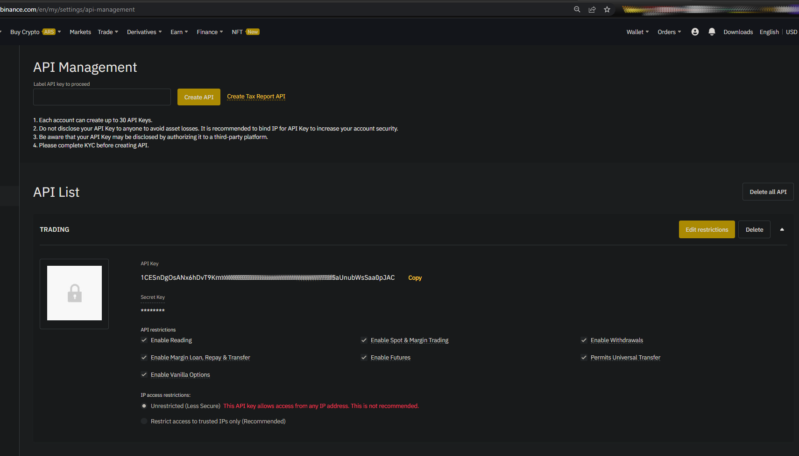

# Binance


# Requisites

- Valid API Key and API Secret, with trading permissions, get it for free at https://www.binance.com/en/my/settings/api-management



- Device Date and Time must be configured, up to the seconds precision, Binance is strict about timestamps,
  use https://github.com/juancarlospaco/binance/blob/nim/examples/binanceVslocalTime.nim to debug time diff.

- Some stablecoin in Binance Spot wallet to trade with, >= 10 USD in USDT at least.
- Some BNB coins in Binance Spot wallet for commisions, >= 1 USD in BNB at least.


# Examples

```nim
import std/httpcore, binance
let client = newBinance("YOUR_BINANCE_API_KEY", "YOUR_BINANCE_API_SECRET")
let preparedEndpoint = client.orderTest(SIDE_BUY, ORDER_TYPE_LIMIT, ORDER_RESP_TYPE_FULL, $TIME_IN_FORCE_GTC, "1", "BTCUSDT", 0.1, 10_000.00)
echo client.request(preparedEndpoint, HttpPost)
```


# TradingBot

- How to create a TradingBot ?.

TradingBot example: https://github.com/juancarlospaco/binance/blob/nim/examples/newcoin.nim


# Documentation

- https://juancarlospaco.github.io/binance


# TestNet Vs Prod

**BY DEFAULT IS USING REAL BINANCE API!.**

- TestNet (Fake Binance, for testing) ` -d:binanceAPIUrl="https://testnet.binance.vision" `.
- Production (Real Binance, for prod) ` -d:binanceAPIUrl="https://api.binance.com" `.


# More

- See also https://github.com/juancarlospaco/tradingview#tradingview
- See also https://github.com/juancarlospaco/cloudbet#cloudbet


# Stars


:star: [@juancarlospaco](https://github.com/juancarlospaco '2022-02-15')
:star: [@kennym](https://github.com/kennym '2022-02-16')
:star: [@nickolaz](https://github.com/nickolaz '2022-02-18')
:star: [@Nacho512](https://github.com/Nacho512 '2022-02-20')
:star: [@hannylicious](https://github.com/hannylicious '2022-03-02')
:star: [@Walter-Santillan](https://github.com/Walter-Santillan '2022-03-21')	
:star: [@kamilchm](https://github.com/kamilchm '2022-03-23')	
